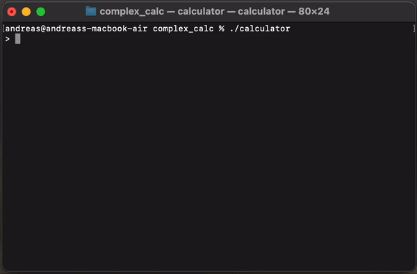

# Simple-interpreter
Calculator with interpreter based on Flex/Bison

### How to use
- run make first!
#### Inline mode 
``` sh
# Inline mode
$ ./calculator
```
#### File parsing 
``` sh
# File parsing
./calculator < test.txt 
```

